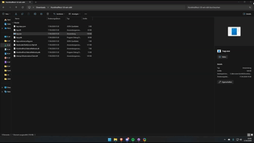
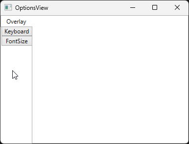

# hunt-and-peck

Simple vimium/vimperator style navigation for Windows applications based on the UI Automation framework. In essence, it works the same as screen readers or accessibility programs but with the goal of making any Windows program faster to use.

It works for any Windows program (excluding Modern UI apps :))

## Demo

## Screenshots

| Overlay | Options | Debug(outdated) 
|---------|---------|----------------|
|  |  |  |

## Installation

### Requirements
- Windows OS
- [.NET 10 Desktop Runtime](https://dotnet.microsoft.com/download/dotnet/10.0)

### Download & Setup

1. Download the latest release from the [Releases page](https://github.com/Fettsackmitch/hunt-and-peck/releases)
2. Extract the ZIP file
3. Run `hap.exe`

## Usage

### Basic Usage

1. Launch the executable — it runs as a system tray icon
2. With any window focused, press `Alt + ,` to activate the overlay
3. Letter labels appear on clickable elements — type the matching characters to invoke them

### Options & Configuration

Right-click the tray icon and select `Options` to open the settings dialog.

#### Hotkeys

All hotkeys are fully customizable. To change a hotkey, click the corresponding text field in the **Keyboard** tab and press your desired key combination.

| Mode | Default | Description |
|------|---------|-------------|
| Overlay | `Alt + ,` | Activate hints for the focused window |
| Taskbar | `Alt + Shift + ,` | Activate hints for the taskbar |
| Debug | `Ctrl + Shift + ,` | Activate debug overlay |

Supported modifiers: `Alt`, `Ctrl`, `Shift`, `Win` (and combinations).

#### Font Size

Adjust the hint label size (8–24 pt) in the **FontSize** tab.

## Known Limitations

- Modern UI apps are not supported
- Only elements with "Invoke" patterns can be interacted with
- Functionality depends on application's UI Automation implementation

## Credits

This project is a fork of the original [hunt-and-peck](https://github.com/zsims/hunt-and-peck) by [@zsims](https://github.com/zsims).

## Disclaimer

This fork is primarily developed for **personal use and learning purposes**. I'm experimenting with the codebase to improve my skills and adapt it to my specific needs.

That said, **suggestions and feedback are always welcome!** If you have ideas for improvements or find bugs, feel free to open an issue or submit a pull request.